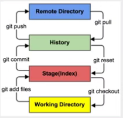

#### 版本控制

>什么是版本控制

版本迭代，在开发中用于管理我们对文件、目录或者工程的版本。

管理文件的修改历史。

###### 本地版本控制
记录文件每次的更新，可以对每一个版本做一个快照，或者记录补丁文件，适合个人使用。

###### 集中版本控制
所有的版本数据都保存在服务器上，协同开发者从服务器上同步更新或上传自己的修改。
定期更新服务器

###### 分布式版本控制
每个人拥有全部的代 码。离线时在本地提交，联网时push到相应的服务器或者用户那里。

#### Git历史
bitkeeper -> git

#### 基本的Linux命令
- cd 改变目录
- cd .. 回退到上一个目录
- pwd 当前所在的目录路径
- ls(ll) 列出当前目录中的所有文件
- touch 新建一个文件
- rm 删除一个文件
- mkdir 新建一个文件夹
- rm -r 删除一个文件夹
- mv 移动文件
- reset 重新初始化终端、清屏
- clear 清屏
- history 查看命令历史
- help 帮助
- exit 退出
- \# 注释

#### Git配置
所有的配置文件都保存在本地
###### 配置用户
git config --global user.name "cc"
git config --global user.email "3230517929@qq.com"

#### Git基本理论
Git本地有三个工作区域：分别为工作目录、暂存区、资源库，如果再加上远程的git仓库，就可以分为四个工作区域。这四个区域之间的转换关系如下：


- working directory 工作区，平时存放项目的地方
- stage 暂存区，用于临时存放改动，事实上它只是一个文件，保存即将提交到文件列表的信息
- repository 仓库区（本地仓库），安全存放数据的位置，有提交到所有版本的数据，其中head是指向最新放入仓库的版本。
- remote 远程仓库，托管代码的服务器

#### Git项目搭建
创建本地仓库的方法有两种一种是创建全新的仓库，另外一种是克隆远程仓库

###### 本地项目搭建
1. git init 初始化项目


###### 远程clone
git clone url

#### Git文件操作
- Untracked 未跟踪： 未入库
- Unmodify 文件已入库： 已入库
- Modified 文件已修改： 入库并且被修改了
- Staged 暂存状态： 暂存状态

```
#查看指定文件的状态
git status [filename]

#查看所有文件的状态
git status

#添加所有文件到暂存区
git add .

#提交暂存区的文件到本地仓库，其中m指的是message
git commit -m "first commit"

```